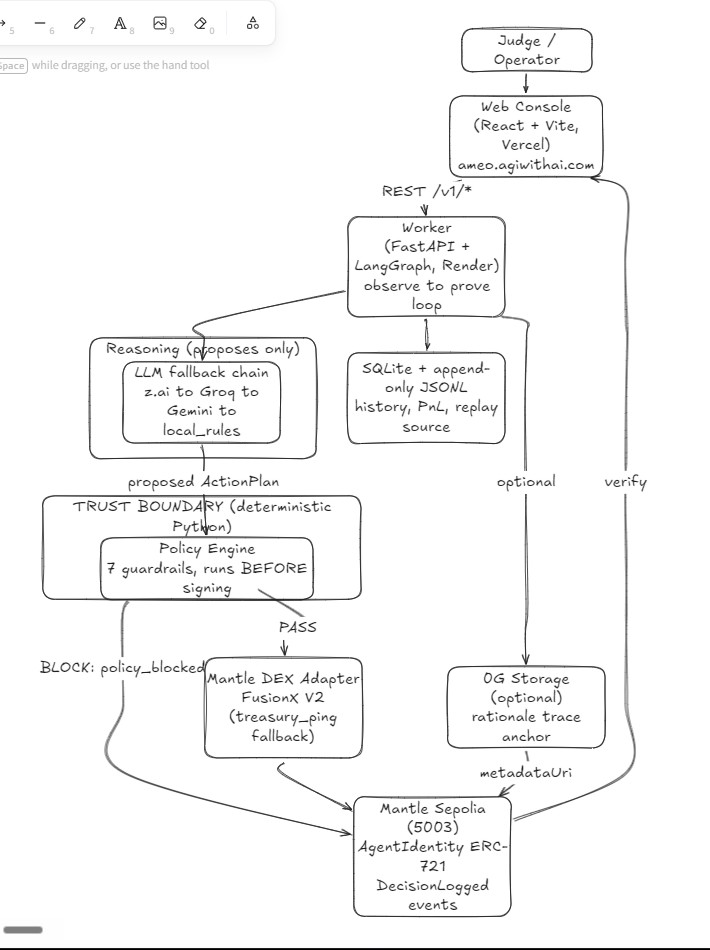
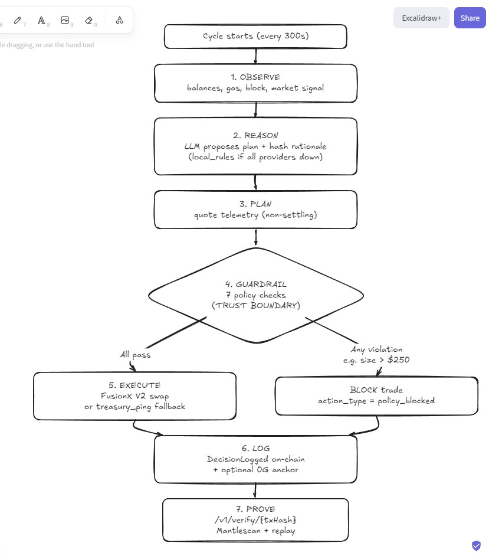

# AMEO — Policy-enforced AI trading agent on Mantle

> **AMEO is a policy-enforced AI trading agent on Mantle that can prove — with on-chain DecisionLogged events — when it refused a risky trade the LLM tried to make.**
>
> The AI suggests. Policy decides. Anyone can verify.
>
> **DoraHacks Turing Test Hackathon 2026**
> - **Track:** AI Trading & Strategy (BGA × Bybit)

AMEO enforces policy guardrails **outside the LLM** — before execution, not after. Every material decision produces a tamper-evident `DecisionLogged` event on Mantle Sepolia.

**Three defining features:**
1. **Policy enforcement outside the LLM** — 7 guardrails checked before every execution (see [`/v1/policies`](https://agentic-micro-economy-os.onrender.com/v1/policies))
2. **Verifiable decisions** — Every rationale, policy check, and execution trace is independently checkable on-chain
3. **Radical transparency** — Live observable agents that adapt and self-correct under policy constraints

- **REST API** — `/v1/*` on the worker (`/v1/verify/{txHash}` for one-shot proof)
- **TypeScript SDK** — `packages/sdk` (local `@ameo/sdk` client; not published to npm yet)
- **MCP server** — `packages/mcp` (local stdio server with 5 tools for Claude Desktop / Cursor)
- **Narrative Console** — live replay at [ameo.agiwithai.com](https://ameo.agiwithai.com)

## Confirm it works in under a minute (no mocks, honest proof)

| Step | What you'll see | Link |
| --- | --- | --- |
| 1. Decision ledger contract | Custom AMEO contract, **verified on Mantlescan** | [`0xB86d…2D652`](https://sepolia.mantlescan.xyz/address/0xB86dC64573089D8DD89C5686010295bB4412D652#code) |
| 2. Real `DecisionLogged` tx | Live worker cycle (check `/api/decisions`) | [ameo.agiwithai.com](https://ameo.agiwithai.com) |
| 3. API verification | `GET /v1/verify/{txHash}` for any logged decision | [Worker API](https://agentic-micro-economy-os.onrender.com/v1/config) |
| 4. Full decision replay | Every policy check, rationale, and settlement trace | [ameo.agiwithai.com/app/replay](https://ameo.agiwithai.com/app/replay) |

The verify endpoint returns transparent proof for every decision — policy checks, rationale hashes, and execution traces.

### Deployed Addresses

- **Agent signer + treasury (server hot EOA):** [`0x59ffc8907beaA275F29B466BCB1D9BbfeaDAd165`](https://sepolia.mantlescan.xyz/address/0x59ffc8907beaA275F29B466BCB1D9BbfeaDAd165)
- **AMEO decision ledger (custom contract):** [`0xB86dC64573089D8DD89C5686010295bB4412D652`](https://sepolia.mantlescan.xyz/address/0xB86dC64573089D8DD89C5686010295bB4412D652) · token `0` minted to signer
- **Live Worker API:** [https://agentic-micro-economy-os.onrender.com](https://agentic-micro-economy-os.onrender.com)
- **Web Console:** [https://ameo.agiwithai.com](https://ameo.agiwithai.com)

> **Wallet note:** Browser wallet connect is viewer-only. Cycles sign with the server hot EOA above — not your connected MetaMask address.

## How policy enforcement works

1. **Observe** — reads treasury balances, gas prices, and market signals from Mantle Sepolia.
2. **Decide** — an LLM proposes an action (swap, hold, rebalance). The reasoning is hashed and committed on-chain via `DecisionLogged`.
3. **Policy check (outside LLM)** — 7 predicates from [`/v1/policies`](https://agentic-micro-economy-os.onrender.com/v1/policies) run **before execution**:
   - `max_drawdown` — portfolio drawdown within configured cap
   - `max_position` — single trade notional ≤ `MAX_POSITION_USD` (e.g. $250)
   - `asset_whitelist` — both legs on allowed list (**USDC, MNT, WMNT**)
   - `protocol_whitelist` — execution protocol must be allowed (e.g. `fusionx_v2`)
   - `observation_quality` — degraded RPC/signals block autonomous action
   - `balance_sufficiency` — treasury holds enough of the input asset
   - `gas_price_guard` — gas spikes above policy limits refuse execution
4. **Execute & log** — if the action passes all checks, AMEO settles via FusionX V2 (or `treasury_ping` testnet fallback). If blocked, `action_type = policy_blocked` and `DecisionLogged` still records the refusal on-chain.

**Key insight:** Policy enforcement happens in deterministic Python code, not in the LLM. The LLM can propose anything — policy decides what actually executes.

**Money shot:** `POST /run-cycle?demo=rogue_block` injects a $900 trade against a $250 cap → `max_position_exceeded` → `policy_blocked` → verifiable `DecisionLogged` on Mantlescan.

## Links

- Live: https://ameo.agiwithai.com
- Docs: https://docs.ameo.agiwithai.com
- Repo: https://github.com/Anand-0037/agentic-micro-economy-os

## What's inside

| Piece | Tech | Purpose |
| --- | --- | --- |
| Worker | Python, FastAPI, LangGraph | Runs the observe → decide → check → execute loop |
| Web console | React, Vite, Tailwind, wagmi | Watch the agent live, replay any past cycle |
| Decision ledger | Solidity 0.8.24, ERC-721 + `logDecision` | Custom contract logging every `DecisionLogged` event |
| Policy engine | Pure-Python rules | Catches bad ideas before they touch the chain |
| Settlement | Mantle Sepolia | Cheap, fast, MNT-paid gas; `DecisionLogged` proof |

### ERC-8004 disclaimer

AMEO aligns with the **spirit** of ERC-8004 agent identity registries. Two distinct layers:

- **Official Mantle ERC-8004 identity NFT** — issued by Mantle for participating hackathon agents. Register signer `0x59ffc…` via the hackathon portal. This is the official identity layer.
- **AMEO decision ledger (`0xB86d…`)** — our **custom** ERC-721 contract that emits `DecisionLogged` events. This is the tamper-evident audit log, not the official Mantle registry.

We are **inspired by ERC-8004, not claiming full compliance** or that our custom contract is the official identity.

### Honest limitations (v1)

- **Self-attestation:** The same hot EOA signs execution and writes `DecisionLogged`. v1 is a tamper-evident audit log; v2 will bind logs to settlement tx hashes.
- **Sepolia liquidity:** Thin DEX pools often force `treasury_ping` (degraded path) instead of FusionX V2 swaps. The UI labels this explicitly.
- **Testnet keys:** Hot EOAs in `.env` are for hackathon demo only. Production path is KMS/MPC.
- **Server-side signing:** Cycles always sign with the configured agent EOA on Render — browser wallet connect does not change signing or treasury balances.

## Architecture

AMEO is built around **verifiable cognition**: every agent decision produces independently auditable artifacts (observation snapshot, LLM-or-rules plan, deterministic policy checks, execution trace, on-chain `DecisionLogged`).

Policy enforcement is **outside the LLM** in pure Python. The LLM only proposes; the guardrails decide.

### System architecture



**Trust boundary:** `policy guardrails` runs in Python **before** any tx is signed. The LLM only proposes.

### Cognition / user flow



The **BLOCK → policy_blocked → DecisionLogged** path is the core demo: the guardrail refuses a trade the LLM proposed, and proves the refusal on-chain.

### Cognition loop details (LangGraph nodes in `apps/worker/ameo_worker/graph.py`)

1. **observe** — Pull treasury balances (MNT/USDC/WMNT), gas price, block, market context. Quality score.
2. **reason** — Structured LLM call (fallback chain: **z.ai → Groq → Gemini → local_rules**) producing `ActionPlan`. Injects recent learnings.
3. **plan** — `mantle.swap.v1` quote telemetry (non-settling).
4. **guardrail** — `GuardrailService` runs `PolicyEngine.validate` + extra checks. **This is the trust boundary.**
5. **act** — If guardrail passes → `MantleDexAdapter.execute_from_plan`. Falls back to `treasury_ping` on thin liquidity.
6. **self_heal** — Limited backoff retries for transient RPC/timeout errors.
7. **log** — Record to SQLite, emit `cycle_completed`, kick off background `finalize_cycle_async`.
8. **finalize** (background) — Call `logDecision` on the decision ledger with `rationaleHash` + cycle metadata (`ameo://cycle/{id}`).

All steps emit typed events to daily `logs/events/events_YYYYMMDD.jsonl` for deterministic replay.

### Data & proof model

- **SQLite** (`data/ameo.db`): execution history, PnL snapshots, learnings.
- **JSONL events**: append-only source of truth for cycle reconstruction. Powers `/api/cycles/{id}` and the Replay UI.
- **On-chain**: `DecisionLogged` on `0xB86dC64573089D8DD89C5686010295bB4412D652`. `rationaleHash` commits to reasoning; `metadataUri` points at cycle replay metadata.
- **Verify path** (`/v1/verify/{txHash}`): on-chain match first → local event fallback (honest, no fabrication).

### Packages & clients

- `packages/contracts/` — Foundry, `MantleAgentIdentity.sol`, deploy scripts.
- `packages/sdk/` — TypeScript client for the v1 API surface (used by web + MCP).
- `packages/mcp/` — stdio MCP server exposing 5 tools for agentic IDEs.
- `packages/prompts/` — Versioned system prompts loaded by worker.

### Deployment topology (current)

- **Worker**: Render (`apps/worker`, `uvicorn`). Health at `/health`. Scheduler on 5-min ticks.
- **Frontend**: Vercel (`apps/web`). Env points at worker URL + contract addresses.
- **Chain**: Mantle Sepolia (chainId 5003). Hot EOA for testnet demo.
- **Observability**: Sentry (worker + web), live logs via SSE.

Local: `uv run uvicorn ...` + `npm run dev`. See `scripts/` for smoke, bootstrap, and `run-rogue-demo.sh`.

### Key safety & honesty properties

- Deterministic Python guardrails always run (even in dry_run or LLM outage).
- LLM never sees private keys.
- Fallback chain never silently guesses; degrades to `local_rules` or refuses.
- UI and verify explicitly surface degraded paths (`treasury_ping`, `local_rules`) instead of fabricating proof.
- Idempotency (plan hash 5m), daily notional caps, duplicate detection in hot path.

See also:
- [docs/architecture.mdx](docs/architecture.mdx)
- [docs/policy-spec.mdx](docs/policy-spec.mdx)
- [docs/concepts/verifiable-cognition.mdx](docs/concepts/verifiable-cognition.mdx)
- [apps/worker/ameo_worker/graph.py](apps/worker/ameo_worker/graph.py)
- Live replay: https://ameo.agiwithai.com/app/replay

## Run it locally

```bash
# 1. Clone, copy env template
cp .env.example .env
# fill in: AGENT_PRIVATE_KEY, AGENT_IDENTITY_ADDRESS, MANTLE_RPC_URL, Z_AI/GROQ/GEMINI keys

# 2. Worker
cd apps/worker && uv sync && uv run uvicorn ameo_worker.main:app --reload

# 3. Web
cd apps/web && npm install && npm run dev
```

**Deploy:** Frontend on [Vercel](https://vercel.com) (`apps/web`). Worker on [Render](https://render.com) — see `render.yaml`. Set `MEMORY_DB_PATH=data/ameo.db`, or attach a Render disk at `/data`.

Deployed worker API: https://agentic-micro-economy-os.onrender.com

## Safety choices, said plainly

- **Policy enforcement is deterministic** — The 7 guardrails run in pure Python, not in the LLM.
- The agent's signing key is a hot EOA in a `.env` file. Fine for testnet demo; swap in KMS or MPC for production.
- Sepolia DEXes have thin liquidity, so swaps may degrade to `treasury_ping`. We surface this honestly in the UI.
- The LLM fallback chain is **z.ai → Groq → Gemini → local_rules**. If every provider is down, the agent uses deterministic rules — policy still enforces.

## Docs

- [Quickstart](docs/quickstart.mdx)
- [Architecture](docs/architecture.mdx)
- [Policy spec](docs/policy-spec.mdx)
- [Worker API](docs/api/worker-api.mdx)
- [Why this matters](docs/why-it-matters.mdx)

---
