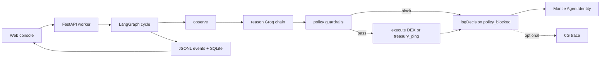

# AMEO — Policy-enforced AI trading agent on Mantle

> **AMEO is a policy-enforced AI trading agent on Mantle that can prove — with on-chain DecisionLogged events — when it refused a risky trade the LLM tried to make. Optional 0G trace anchoring when configured.**
>
> The AI suggests. Policy decides. Anyone can verify.
>
> **DoraHacks Turing Test Hackathon 2026**
> - **Primary Track:** AI Trading & Strategy (BGA-sponsored)
> - **Secondary Track:** AI Alpha & Data
> - **BUIDL ID:** #44123

AMEO enforces policy guardrails **outside the LLM** — before execution, not after. Every decision produces a tamper-evident record on Mantle via ERC-8004-inspired identity + `DecisionLogged` events. Full cognition traces can be anchored to 0G Storage when `ZERO_G_*` is configured.

**Three defining features:**
1. **Policy enforcement outside the LLM** — 7 guardrails checked before every execution (max drawdown, whitelist, trade size, gas budget, etc. dynamically configured via `/v1/config`)
2. **Verifiable decisions** — Every rationale, policy check, and execution trace is independently checkable on-chain
3. **Radical transparency** — Live observable agents that adapt and self-correct under policy constraints

- **REST API** — `/v1/*` on the worker (`/v1/verify/{txHash}` for one-shot proof)
- **TypeScript SDK** — `@ameo/sdk` npm package
- **MCP server** — `@ameo/mcp` for Claude Desktop and Cursor
- **Narrative Console** — live replay at [ameo.agiwithai.com](https://ameo.agiwithai.com)
- **Demo Video** — [Watch the 90-second pitch](https://youtube.com) *(Placeholder)*
- **Strategy Alpha Verification** — [57-sample Eval Report](https://agentic-micro-economy-os.onrender.com/api/eval-report) (Sharpe / Max Drawdown)

## Confirm it works in under a minute (no mocks, honest proof)

| Step | What you'll see | Link |
| --- | --- | --- |
| 1. Verified agent contract | ERC-8004-inspired identity (Sourcify verified) | [`0xB86d…2D652`](https://sepolia.mantlescan.xyz/address/0xB86dC64573089D8DD89C5686010295bB4412D652) |
| 2. Real `DecisionLogged` tx | Live worker cycle (check `/api/decisions`) | [ameo.agiwithai.com](https://ameo.agiwithai.com) |
| 3. API verification | `GET /v1/verify/{txHash}` for any logged decision | [Worker API](https://agentic-micro-economy-os.onrender.com/v1/config) |
| 4. Full decision replay | Every policy check, rationale, and settlement trace | [ameo.agiwithai.com/app/replay](https://ameo.agiwithai.com/app/replay) |

The verify endpoint returns transparent proof for every decision — policy checks, rationale hashes, and execution traces.

### Deployed Addresses & Registry

- **Burner wallet (owner + agent signer + treasury):** [`0x59ffc8907beaA275F29B466BCB1D9BbfeaDAd165`](https://sepolia.mantlescan.xyz/address/0x59ffc8907beaA275F29B466BCB1D9BbfeaDAd165)
- **Agent Identity (Registry):** [`0xB86dC64573089D8DD89C5686010295bB4412D652`](https://sepolia.mantlescan.xyz/address/0xB86dC64573089D8DD89C5686010295bB4412D652) · token `0` minted to burner
- **Live Worker API:** [https://agentic-micro-economy-os.onrender.com](https://agentic-micro-economy-os.onrender.com)
- **Web Console:** [https://ameo.agiwithai.com](https://ameo.agiwithai.com)

## How policy enforcement works

1. **Observe** — reads wallet balances, gas prices, and market signals from Mantle Sepolia.
2. **Decide** — an LLM proposes an action (swap, hold, rebalance). The reasoning is hashed and stored on 0G Storage.
3. **Policy check (outside LLM)** — 7 hard rules are checked **before execution**:
   - Max drawdown limit (dynamically set in `/v1/config`, e.g., 12% cap)
   - Asset whitelist (USDC, MNT only)
   - Trade size cap (dynamically set in `/v1/config`, e.g., $250 max)
   - Gas budget limit
   - Minimum balance requirements
   - Slippage tolerance (dynamically set in `/v1/config`, e.g., 1% max)
   - Execution frequency limits
4. **Execute & log** — if the action passes all policy checks, AMEO settles via FusionX V2 DEX adapter (or treasury_ping testnet fallback), then emits `DecisionLogged` on the identity contract with full policy proof.

**Key insight:** Policy enforcement happens in deterministic Python code, not in the LLM. The LLM can propose anything — policy decides what actually executes.

## Links

- Live: https://ameo.agiwithai.com
- Docs: https://docs.ameo.agiwithai.com
- Repo: https://github.com/Anand-0037/agentic-micro-economy-os

## What's inside

| Piece | Tech | Purpose |
| --- | --- | --- |
| Worker | Python, FastAPI, LangGraph | Runs the observe → decide → check → execute loop |
| Web console | React, Vite, Tailwind, wagmi | Watch the agent live, replay any past cycle |
| Identity contract | Solidity 0.8.24, ERC-8004-inspired + ERC-721 | One NFT = one agent. Every decision is an event logged under this NFT (Note: Mantle contracts issue the agent identity NFT; decisions are logged under it). |
| Policy engine | Pure-Python rules (drawdown, exposure, whitelist) | Catches bad ideas before they touch the chain |
| Storage | 0G testnet | Permanent, addressable record of every reasoning trace |
| Settlement | Mantle Sepolia | Cheap, fast, MNT-paid gas |

### ERC-8004 Agent Registry Disclaimer
While AMEO aligns with the spirit of the ERC-8004 standard for agent identity registries, the actual ERC-721 token representing the agent is issued on the Mantle Sepolia network. The agent identity contract records permanent `DecisionLogged` event traces mapped to this specific token ID. It is **inspired by ERC-8004, not claiming full compliance**.

### Honest limitations (v1)
- **Self-attestation:** The same hot EOA signs execution, writes `DecisionLogged`, and anchors 0G receipts. v1 is a tamper-evident audit log; v2 will bind logs to settlement tx hashes.
- **Sepolia liquidity:** Thin DEX pools often force `treasury_ping` (degraded path) instead of FusionX V2 swaps. The UI labels this explicitly.
- **Testnet keys:** Hot EOAs in `.env` are for hackathon demo only. Production path is KMS/MPC.

## Architecture

AMEO is built around **verifiable cognition**: every agent decision produces independently auditable artifacts (observation snapshot, LLM-or-rules plan, deterministic policy checks, execution trace, 0G-anchored rationale, on-chain `DecisionLogged`).

Policy enforcement is **outside the LLM** in pure Python. The LLM only proposes; the guardrails decide.

### System diagram (minimal)



**Trust boundary:** `policy guardrails` runs in Python **before** any tx is signed. The LLM only proposes.

### Cognition Loop Details (LangGraph nodes in `apps/worker/ameo_worker/graph.py`)

1. **observe** — Pull treasury balances (MNT/USDC), gas price, block, optional market context. Quality score.
2. **reason** — Structured LLM call (or rules_planner fallback on provider failure) producing `ActionPlan` (swap / no_op / ...). Injects recent learnings.
3. **plan** — Optional `mantle.swap.v1` quote telemetry invocation (non-settling).
4. **guardrail** — `GuardrailService` runs `PolicyEngine.validate` + extra checks (observation quality, balance sufficiency, gas spike, protocol whitelist, daily volume). **This is the trust boundary.**
5. **act** — If guardrail passes + live permitted + not idempotent duplicate → `MantleDexAdapter.execute_from_plan`. Falls back to treasury_ping on thin liquidity. Records notional.
6. **self_heal** — Limited backoff retries for transient RPC/timeout errors.
7. **log** — Record to SQLite (history/PnL/learnings), emit `cycle_completed`, kick off background `finalize_cycle_async`.
8. **finalize** (background) — Upload full trace (obs + plan + policy_checks + events + exec) to 0G → obtain root hash. If successful execution, call `logDecision` on identity contract (V1 sig for deployed contract) with `rationaleHash` (keccak of rationale) + `metadataUri` (0G root) + PnL.

All steps emit typed events to daily `logs/events/events_YYYYMMDD.jsonl` for deterministic replay.

### Data & Proof Model

- **SQLite** (`data/ameo.db` or configured `MEMORY_DB_PATH`): execution_history, pnl_snapshots, learnings. Used for `/api/history`, performance, trophies.
- **JSONL events**: append-only source of truth for cycle reconstruction. Powers `/api/cycles/{id}` and the Replay UI's 8-node rail.
- **On-chain**: `DecisionLogged` on the `AgentIdentity` ERC-721 (deployed at `0xB86dC64573089D8DD89C5686010295bB4412D652`). `rationaleHash` commits to reasoning; `metadataUri` / `dataHash` point at 0G trace. (See broadcast/ for exact deployment tx.)
- **0G**: Full structured trace (including every `guardrail_evaluated` violation) is the permanent off-chain record. Verifiable via indexer root hash.
- **Verify path** (`/v1/verify/{txHash}`): on-chain match first → local event fallback (honest, no fabrication) → 404 with guidance.

Policy predicates (see `/v1/policies` and `guardrail_service.py` + `policy.py`): max_drawdown, max_position, asset_whitelist, protocol_whitelist, observation_quality, balance_sufficiency, gas_price_guard, daily_volume (in act).

### Packages & Clients

- `packages/contracts/` — Foundry, `MantleAgentIdentity.sol` (ERC-721 + logDecision), deploy scripts.
- `packages/sdk/` — `@ameo/sdk` thin TS client for the v1 surface (used by web + MCP).
- `packages/mcp/` — `@ameo/mcp` stdio server exposing 5 tools for agentic IDEs.
- `packages/prompts/` — Versioned system prompts (P-001 planner etc.) loaded by worker.
- `packages/shared/config/` — Token/chain constants.

### Deployment Topology (current)

- **Worker**: Render (python, `apps/worker`, `uvicorn`, disk for DB optional). Health at `/health`. Scheduler always on.
- **Frontend**: Vercel (`apps/web`). Env points at worker URL + contract addresses.
- **Chain**: Mantle Sepolia (chainId 5003). Hot EOA for testnet (documented safety choice).
- **Storage**: 0G testnet (CLI + wallet gas on Galileo).
- **Observability**: Sentry (worker + web), live logs via SSE.

Local: `uv run uvicorn ...` + `npm run dev`. See `scripts/` for smoke, bootstrap, live loop tests. `LIVE_ENABLED=false` / `WORKER_MODE=dry_run` by default.

### Key Safety & Honesty Properties

- Deterministic Python guardrails always run (even in dry_run or LLM outage).
- LLM never sees private keys.
- Fallback chain never silently guesses; degrades to rules or refuses.
- UI and verify explicitly surface "execution_evidence_only" or missing 0G cases instead of fabricating proof.
- Idempotency (plan hash 5m), daily notional caps, duplicate detection in hot path.
- Contracts are simple; full history lives in events + on-chain logs (no complex on-chain state machines).

See:
- [docs/architecture.mdx](docs/architecture.mdx) (source of truth for some diagrams)
- [docs/policy-spec.mdx](docs/policy-spec.mdx)
- [docs/concepts/verifiable-cognition.mdx](docs/concepts/verifiable-cognition.mdx)
- [apps/worker/ameo_worker/graph.py](apps/worker/ameo_worker/graph.py) (the loop)
- Live replay: https://ameo.agiwithai.com/app/replay

## Run it locally

```bash
# 1. Clone, copy env template
cp .env.example .env
# fill in: AGENT_PRIVATE_KEY, AGENT_IDENTITY_ADDRESS, MANTLE_RPC_URL, OPENAI/Z.AI/GROQ keys

# 2. Worker
cd apps/worker && uv sync && uv run uvicorn ameo_worker.main:app --reload

# 3. Web
cd apps/web && npm install && npm run dev
```

**Deploy:** Frontend on [Vercel](https://vercel.com) (`apps/web`). Worker on [Render](https://render.com) — see `render.yaml` and `apps/worker/scripts/render-build.sh`. Set `MEMORY_DB_PATH=data/ameo.db`, or attach a Render disk at `/data` and use `MEMORY_DB_PATH=/data/ameo.db`.

Deployed worker API: https://agentic-micro-economy-os.onrender.com

## Safety choices, said plainly

- **Policy enforcement is deterministic** — The 7 guardrails run in pure Python, not in the LLM. The LLM can propose anything; policy decides what executes.
- The agent's signing key is a hot EOA in a `.env` file. That's fine for a testnet demo. For production, swap in KMS or MPC. We've isolated the key path so this is a one-file change.
- Sepolia DEXes have thin liquidity, so when a swap can't fill cleanly, the agent falls back to a self-transfer (`treasury_ping`) that still proves the policy → signing → RPC path. We surface this honestly in the UI.
- The LLM has a fallback chain: Groq → z.ai → Gemini → local rules. If every provider is down, the agent **refuses to act** rather than guessing. Policy still enforces even when LLMs fail.

## Docs

- [Quickstart](docs/quickstart.mdx)
- [Architecture](docs/architecture.mdx)
- [Policy spec](docs/policy-spec.mdx)
- [Worker API](docs/api/worker-api.mdx)
- [Why this matters](docs/why-it-matters.mdx)

---

### Turing Test Hackathon 2026 Submission Summary
- **BUIDL #44123**
- **Primary Track:** AI Trading & Strategy (BGA-sponsored)
- **Secondary Track:** AI Alpha & Data
