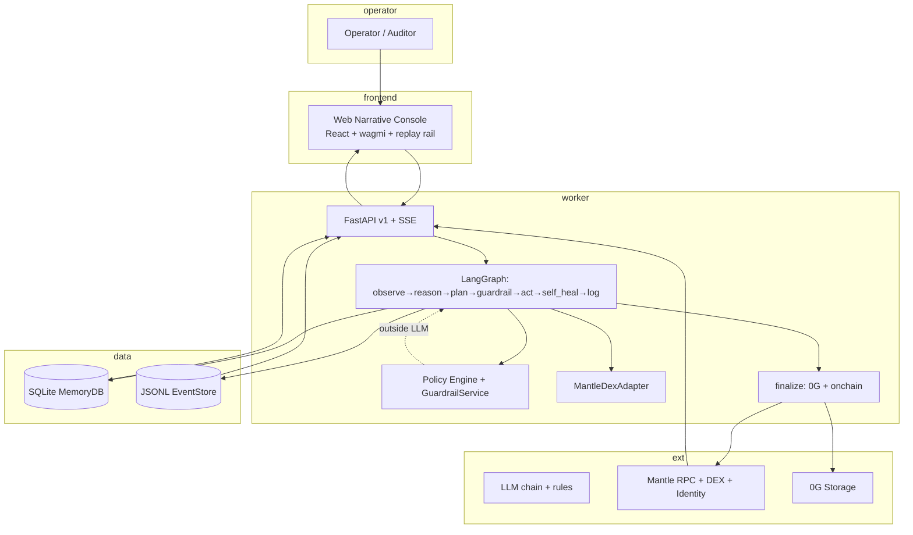

Every component described here is implemented in this repository — not mocked for demos.

> **Full final architecture diagram, data flows, packages, deployment, and proof model**: see the [project README → Architecture section](https://github.com/Anand-0037/agentic-micro-economy-os/blob/main/README.md#architecture). The diagram and breakdown below are a concise system view.

## System context (overview)

## Components

| Component | Responsibility |
| --- | --- |
| `apps/worker/` | FastAPI + LangGraph: observe, plan, guard, act, log |
| `apps/worker/ameo_worker/adapters/mantle_dex.py` | DEX quotes, calldata, broadcast on Mantle Sepolia |
| `packages/contracts/` | `MantleAgentIdentity.sol`, Foundry deploy scripts |
| `apps/web/` | Narrative Console — dashboard, replay, decisions, policy view |
| `packages/prompts/` | Versioned planner prompt registry |
| SQLite + JSONL | Persistent memory and append-only cycle events |

## Cognition loop

The LangGraph state machine in `apps/worker/ameo_worker/graph.py` runs:

**observe → delta_neutral (lp/perps when vol) → reason → plan → guardrail → act → self_heal → log** (finalize runs async for 0G + onchain).

Each transition emits structured events to `logs/events/events_*.jsonl`. The replay API (`GET /api/cycles/{id}`) + UI reconstructs the full verifiable cognition rail (observation through on-chain + 0G proof). See the [project README#architecture](https://github.com/Anand-0037/agentic-micro-economy-os/blob/main/README.md#architecture) for the detailed final diagram.

## Data model (minimal)

| Store | Key entities |
| --- | --- |
| SQLite | runs, plans, executions, performance history |
| JSONL | `cycle_started`, `observation_completed`, `plan_generated`, `guardrail_evaluated`, `action_executed`, `cycle_completed` |
| On-chain | `[DecisionLogged](/glossary#decisionlogged-event)(agentId, rationaleHash, pnl1e18, actionType, metadataUri, dataHash, operator)` |

## Security defaults

- `LIVE_ENABLED=false` and `WORKER_MODE=dry_run` by default
- Max daily notional and per-trade caps before execution
- Private keys never passed to LLM prompts
- Slither recommended on contracts before mainnet

## Deployment

| Service | Port | Notes |
| --- | --- | --- |
| Worker API | `:8000` | Docker Compose or `uvicorn` |
| Web | `:5173` | Vite dev; static build for production |
| Contracts | — | Mantle Sepolia via Foundry scripts |

See [Deploy guide](/guides/deploy) for production hosting.
