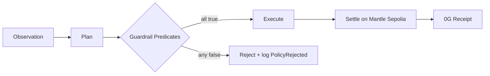

Predicates are evaluated **outside** the LLM; the model cannot bypass them. Each [policy predicate](/glossary#policy-predicate) is a boolean rule enforced before any transaction is signed.

## System diagram



Settlement happens on [Mantle Sepolia](/glossary#mantle-sepolia); reasoning traces anchor to [0G Storage](/glossary#0g-storage).

## Predicate set

| Predicate | Invariant | Code reference |
| --- | --- | --- |
| `drawdown_ok(state, plan)` | `pnl_24h_pct ≥ -MAX_DRAWDOWN_PCT` | `policy.py` — drawdown check in `PolicyEngine.validate` |
| `whitelist_ok(plan)` | `∀ token ∈ plan.actions, token ∈ ALLOWED_TOKENS` | `policy.py` — `asset_in_not_allowed` / `asset_out_not_allowed` |
| `trade_size_ok(plan)` | `∀ a ∈ plan.actions, a.usd_notional ≤ MAX_TRADE_SIZE_USD` | `policy.py` — `max_position_exceeded` |
| `slippage_ok(plan)` | `∀ a ∈ plan.actions, a.expected_slippage_bps ≤ MAX_SLIPPAGE_BPS` | `settings.py` — `DEX_SLIPPAGE_BPS` at execution adapter |
| `daily_volume_ok(state, plan)` | `today_volume + plan.notional ≤ MAX_DAILY_VOLUME_USD` | `graph.py` — daily volume cap in `act` |

## Composition

```
plan_approved ⇔ drawdown_ok ∧ whitelist_ok ∧ trade_size_ok ∧ slippage_ok ∧ daily_volume_ok
```

Additional runtime checks in `GuardrailService.check_plan`: observation quality, balance sufficiency, gas spike guard, protocol whitelist.

## Failure mode

Any predicate false → plan rejected → `guardrail_evaluated` event with `violations[]` → surfaced in replay Policy validation node. No on-chain execution proceeds.

## Design principle

Most agent stacks treat policy as an LLM judgment call. AMEO separates **cognition** (LLM or rules planner) from **authorization** (deterministic predicates). A fluent rationale cannot override a failed drawdown or whitelist check.

To add a custom predicate, see [Write a policy](/guides/write-a-policy).
